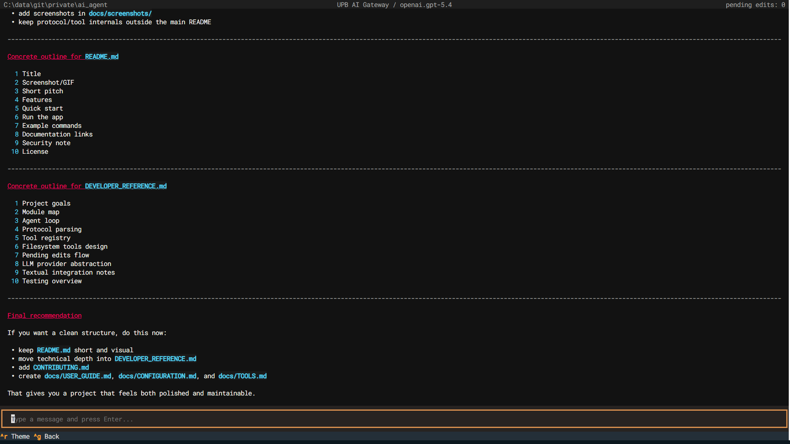
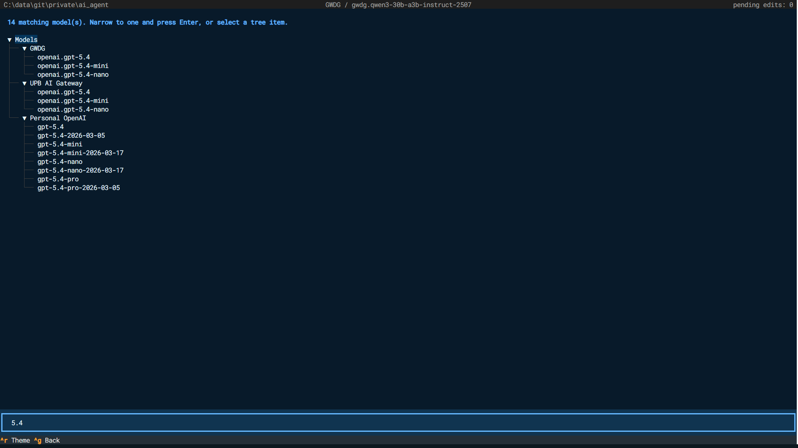
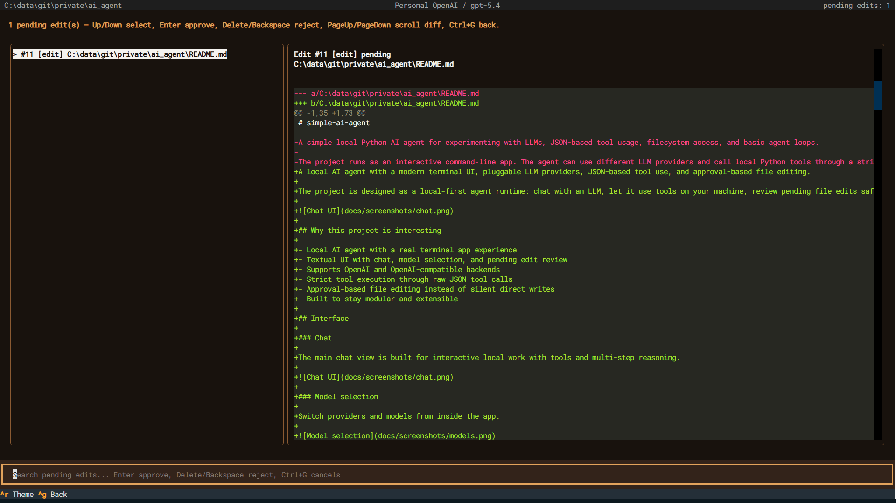

# simple-ai-agent

A local-first coding agent with a Textual terminal UI, pluggable LLM backends, tool calling, persistent chat history, and approval-based file operations.

The project is independent and is not affiliated with any university, research institution, or model provider.



## Highlights

- Textual terminal UI with chat, model switching, chat history, and pending-change review
- OpenAI Responses API, OpenAI-compatible Chat Completions, and Google Gemini through Vertex AI
- Native tool calling where supported, with a JSON protocol fallback
- Bounded, fail-fast tool batches
- Exact-match file edits that remain pending until explicitly approved
- Pending create, replace, move, copy, and delete operations
- Filesystem, Python AST, HTTP, safe shell, math, and knowledge-search tools
- Local knowledge routing and optional Qdrant-backed indexes
- PDF-to-Markdown reading through PyMuPDF4LLM

## Requirements

- Python 3.11 or newer
- An API key for key-based providers, or Google Cloud Application Default Credentials for Vertex AI

## Installation

```bash
python -m venv .venv
```

Activate the environment:

```powershell
# Windows PowerShell
.venv\Scripts\Activate.ps1
```

```bash
# macOS/Linux
source .venv/bin/activate
```

Install dependencies:

```bash
python -m pip install -r requirements.txt
```

For tests:

```bash
python -m pip install -r requirements-dev.txt
```

## Provider configuration

Copy the example files:

```bash
cp providers.example.toml providers.toml
cp .env.example .env
```

PowerShell equivalents:

```powershell
Copy-Item providers.example.toml providers.toml
Copy-Item .env.example .env
```

Keep secrets in `.env`; `providers.toml` should reference them by environment-variable name.

OpenAI Responses API example:

```toml
[[providers]]
key = "openai"
label = "OpenAI"
api_type = "responses"
api_key_env = "OPENAI_API_KEY"
default_model = "gpt-4.1-mini"
supports_model_listing = true
```

Google Gemini through Vertex AI and Application Default Credentials (ADC):

```toml
[[providers]]
key = "gemini_vertex"
label = "Google Gemini (Vertex AI / ADC)"
api_type = "gemini_vertex"
project_env = "GOOGLE_CLOUD_PROJECT"
location = "global"
default_model = "gemini-2.5-flash"
supports_model_listing = true
```

Install the Google Cloud CLI, enable Vertex AI in the project, and authenticate once:

```bash
gcloud auth application-default login
gcloud config set project YOUR_PROJECT_ID
gcloud services enable aiplatform.googleapis.com --project YOUR_PROJECT_ID
```

Then set `GOOGLE_CLOUD_PROJECT=YOUR_PROJECT_ID` and `GOOGLE_CLOUD_LOCATION=global` in `.env`. The global endpoint is required for some Gemini 3.x models that appear in regional catalogues but cannot be invoked from those regional endpoints. No Gemini API key is stored by this application. For local development ADC uses the credential file managed by `gcloud`; deployed environments should use an attached service account/workload identity instead.

Gemini models are discovered through the Vertex AI catalogue and filtered to generative Gemini models. If catalogue access fails, the configured `default_model` remains available. Gemini currently uses the agent's JSON tool-call protocol rather than Gemini-native function calling.

Generic OpenAI-compatible example:

```toml
[[providers]]
key = "openai_compatible"
label = "OpenAI-Compatible API"
api_type = "chat_completions"
api_key_env = "OPENAI_COMPATIBLE_API_KEY"
base_url_env = "OPENAI_COMPATIBLE_BASE_URL"
default_model_env = "OPENAI_COMPATIBLE_DEFAULT_MODEL"
supports_model_listing = true
```

Corresponding `.env` values:

```dotenv
OPENAI_API_KEY=your-key
OPENAI_COMPATIBLE_API_KEY=your-key-or-placeholder
OPENAI_COMPATIBLE_BASE_URL=http://localhost:1234/v1
OPENAI_COMPATIBLE_DEFAULT_MODEL=your-model
```

The app starts with the `openai` provider when present, otherwise the first configured provider. That provider must define a default model.

Never commit `.env`, `providers.toml`, credentials, or private chat data.

## Run

```bash
python main_textual.py
```

The main views support:

- provider/model selection
- persistent chat selection
- pending operation review and approval
- working-directory navigation
- light/dark theme switching





## Tooling

The agent can:

- navigate, read, find, and search local files
- extract PDFs as Markdown
- inspect Python modules with the AST
- propose file edits and filesystem operations for approval
- run a small OS-specific shell-command allowlist
- fetch public HTTP(S) URLs
- perform arithmetic
- search configured local knowledge sources and chat history

Relative paths resolve against the active working directory. Absolute paths are supported.

## File-operation safety

Mutation tools do not write immediately. They create pending operations that must be approved in the UI. Exact-match edits are replayed against the latest file content at approval time and are rejected when changes overlap or the expected text is no longer uniquely present.

This protects against accidental writes, but it is not a sandbox. Read tools, approved operations, and allowed shell commands run with the permissions of the Python process.

## Knowledge search

`knowledge_search` routes a query across configured local capabilities. It can use local keyword stores and optional Qdrant indexes for capability routing, chat history, and long-term memory.

Configuration lives in `config/knowledge.yaml`. Qdrant can run through the client's local persistent mode or through the localhost-only service in `docker-compose.qdrant.yml`.

Embedding and index data stay local unless you explicitly configure otherwise. The selected LLM provider can still receive tool observations as conversation context.

## Commands

- `\help` — command overview
- `\models` — select a provider/model
- `\chats` — browse saved chats
- `\new_chat` — start a new chat
- `\history` — list recent chats
- `\pending` — review and resolve pending operations
- `\pwd` / `\cd <path>` — inspect or change the working directory
- `\state` — show runtime state
- `\reset` — reset the active conversation
- `\theme` — switch the color theme
- `\quit` — quit

## Development

Run the tests:

```bash
python -m pytest -q
```

Optional checks:

```bash
ruff check .
mypy .
```

## Security

- There is no filesystem sandbox.
- File and PDF contents read by tools may be sent to the selected LLM provider.
- The HTTP tool blocks local/private destinations.
- Shell execution is restricted to an explicit command allowlist, not fully isolated.
- Review every pending operation before approval.
- Keep local credentials and history out of version control.

## License

MIT
